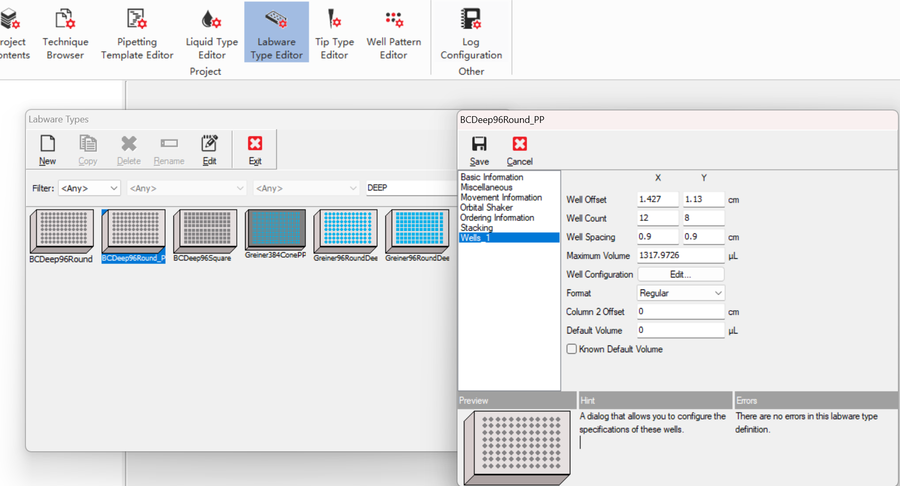
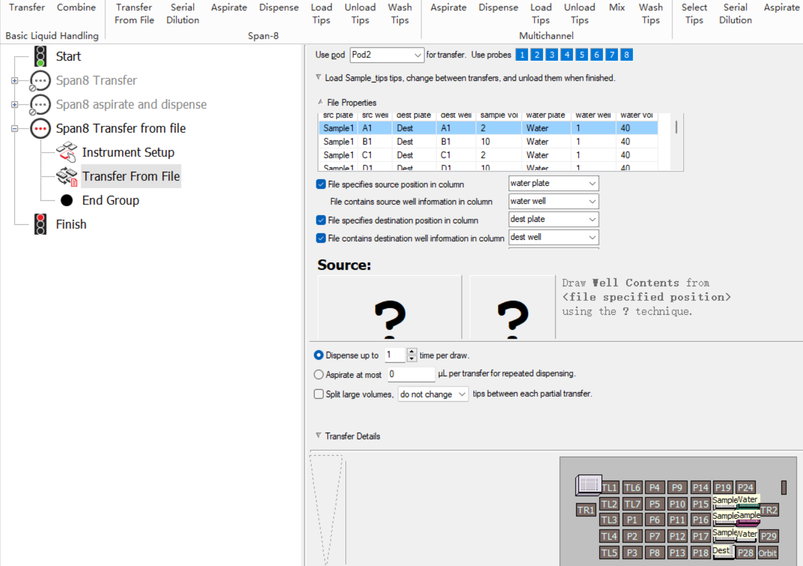
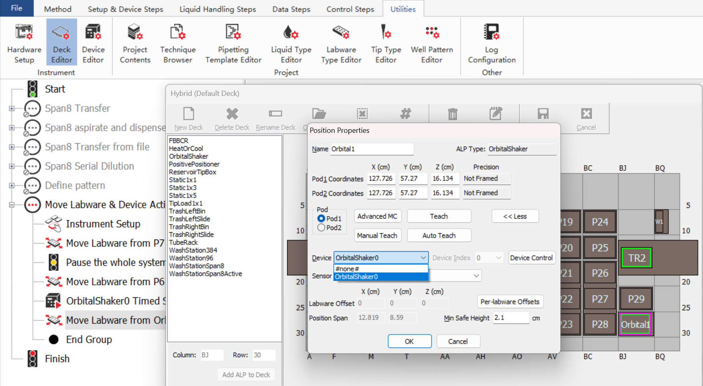
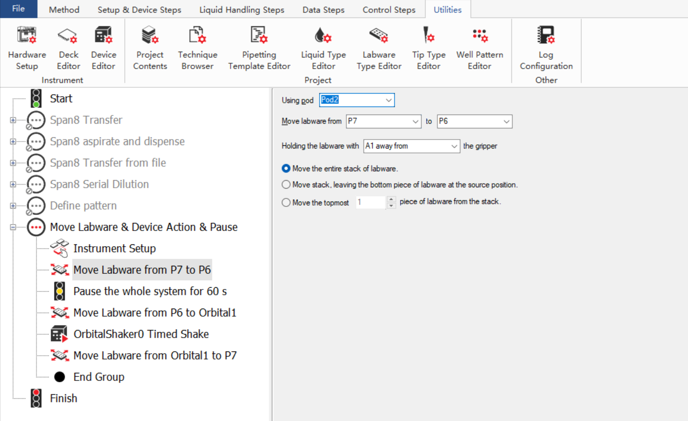

# Biomek软件培训班_20240808

+ 配置Deck

  

  

  static1x1

  Tiploader1x1

  Orbitalshaker

  编号，Renumber

  save

+ 仪器配置

  配置方法导入导出，*.bmf格式文件

  包括labware classes, technique

+ 方法保护

  

+ Home all axes

+ Method | History，方法历史版本

+ Setup & Device Steps

  + Instrument setup
  + Move Labware，转板
  + Hold labware，边抓盖子边移液操作

+ Data Steps

  数据管理，报告，追踪

+ Control Steps

  创建命令组，注释，控制条件，变量赋值，脚本，worklist表单

## 新建方法

+ Instrument setup

  + pause to confirm setup?

  + pause for bar code input?

  + verify pod setup

  + 摆放labware

+ Utilities | Labware type editor

  

  + copy模板，然后再编辑
  + edit编辑耗材信息，basic info由厂家提
  + well offset，耗材左侧到A1孔中心的距离
  + well configuration，设置well的形状信息
  + maximum volume应小于计算的体积最大值
  + Copy BC90枪头再编辑

+ Utilities | Technique Browser

  + pipetting template

  + liquid level sensing，Span8石墨吸头，液面感应，计算体积

  + calibration

  + liquid type

    粘稠的液体可慢吸慢放，设置delay

    trailing air gap，避免大体积液体低落

    打液，cutoff velocity刹车值？

    blowout，打空气柱

    tip touch，碰壁参数

    prewet，预湿润参数

  + aspirate

    到达孔内的速度

    吸液位置，以耗材为基准，正值往上，负值往下

    液面追随，-2 mm from the liquid

    吸液前mix参数

    trailing air gap，设置完成后需要在liquid type中设置相应参数

  + dispense

    干板打小体积，底部打液

    粘稠液体可（多次）碰壁

+ 新建technique

  + 复制模板technique，paste，properties中设置rename，取消方法的耗材限定

+ Transfer

+ Variable

  + Start中设置global var

+ Control Steps实现循环打液

  

  与号替换字符串。

  > ="Plate_"&plate_number

+ Select Tips

  

+ Select Tips & Serial Dilution

  现在instrument中设置第一列（母液）体积为100微升

  然后在serial dilution中选择梯度稀释比

  

  

+ Select Tips & Advanced select tips

  设置额外一盒空枪头盒，放在TL

+ Span8 Transfer pooling

  

  

+ Span8 aspirate and dispense

  加载枪头

  添加Loop，col=1~5

  从Buffer吸液

  打液至Dest板，打到column位置设置为右键Dest板，specify selection as Text，=col

  卸载枪头

  

+ Span8 Transfer from file

  | src plate | src well | dest plate | dest well | sample vol | water plate | water well | water vol |
| --------- | -------- | ---------- | --------- | ---------- | ----------- | ---------- | --------- |
  | Sample1   | A1       | Dest       | A1        | 2          | Water       | 1          | 40        |
  | Sample1   | B1       | Dest       | B1        | 10         | Water       | 1          | 40        |
  | Sample1   | C1       | Dest       | C1        | 2          | Water       | 1          | 40        |
  | Sample1   | D1       | Dest       | D1        | 10         | Water       | 1          | 40        |
  | Sample1   | E1       | Dest       | E1        | 2          | Water       | 1          | 40        |
  | Sample1   | F1       | Dest       | F1        | 10         | Water       | 1          | 40        |
  | Sample1   | G1       | Dest       | G1        | 2          | Water       | 1          | 40        |
  | Sample1   | H1       | Dest       | H1        | 10         | Water       | 1          | 40        |
  
  
  
+ Span8 Serial Dilution

  

  
  
+ Define pattern对随机样本个数和不规则位置加样有帮助

  

  
  
+ Move Labware & Device Action & Pause

  

  
  
  
  
  
  
+ END

  

# Biomek软件培训班_20240809

## 新建方法

+ Peltier Step
+ Hold Labware
+ Start中的变量
+ 耗材的定义与编辑、导入/导出
+ 导入/导出方法
+ Manual Control
+ Pod1 (MC96/384)
+ Pod2 (Span8)
+ OrbitalShakerALP
+ Device Controller

## Variables

+ 命名方法

  + 以字母开头
  + 字母，数字，下划线_的组合
  + <255字符

+ 局域变量

  + for loop

  + Let x=

    >  无prompt

+ 全局变量

  + Start中设置
  + Let X局域变量中set global

+ Case1

  利用变量，使用span8完成从buffer到dest板中某几列的移液

  

  

+ Case2

  自动选择枪头

  

  

+ Case3

  条件判断，Instrument Setup中可根据变量灵活加载耗材，设置体积，根据体积加载枪头90/230；

  **吸液打液速度根据转液体积变量调整；**

  90和230放在P21位置，根据P21位置引用load tips。

  

+ Case4

  for loop完成1-38孔的span8移液

  

  

+ Case5

  可以设置数组指定孔位

  

+ Case6

  从一块板到多块板的分液

  VB函数名不区分大小写？

  VB取整函数，CInt()四舍五入，Int()，Fix()，

  ```vbscript
  # if samplenum Mod 8 <>0
  if samplenum Mod 8 =0
      then
  else
      then
  ```

  

+ Case7

  完成枪头盒或其他labware的重复调用，Finish中取消勾选clear current instrument setup of all labware

  运行一次

  再次运行方法是，clear重复用的耗材，As is选择下方重复用的耗材（虚框）

  

  

+ **其他control steps**

  Just in time，让两边机械臂同时干活

  Define procedure，定义函数

  Run procedure，调用函数

  Run method，调用方法模块，取消Instrument Setup中的pause to confirm setup

  Worklist，工作表格

  Script，VB脚本

  Define pattern，Utilities中well pattern editor

  Create group, Next labware

  > Create group, Next labware
  >
  > 堆叠板子，但不要把带盖子的板子放在一起
  >
  > 堆叠枪头盒需要改板子

+ 